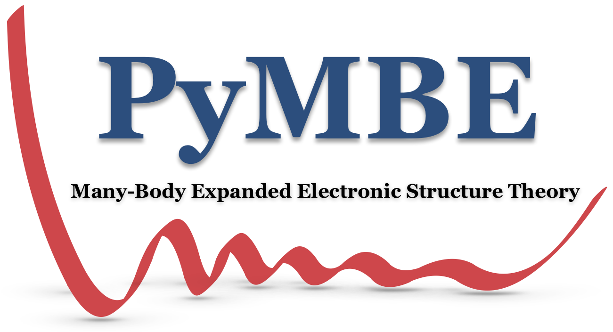

PyMBE: A Many-Body Expanded Correlation Code by Dr. Janus Juul Eriksen 
======================================================================

News
----

* **October 2019**: The PyMBE code is now open source under the MIT license. More to follow.

Prerequisites
-------------

* [Python](https://www.python.org/) 3.7 or higher
* [PySCF](https://pyscf.github.io/) 1.6 or higher and its requirements
* [mpi4py](https://mpi4py.readthedocs.io/en/stable/) 3.0.0 or higher built upon an MPI-3 library 

Features
--------

* Many-Body Expanded Full Configuration Interaction.
    - Calculations of Ground State Correlation Energies, Excitation Energies, and (Transition) Dipole Moments.
    - Coupled Cluster Intermediate Base Models: CCSD & CCSD(T).
    - Arbitrary Reference Spaces.
    - Full Abelian Point Group Symmetry.
    - Closed- and Open-Shell Implementations.
    - Restricted Hartree-Fock (RHF/ROHF) and Complete Active Space Self-Consistent Field (CASSCF) Molecular Orbitals.
* Massively Parallel Implementation.
* MPI-3 Shared Memory Parallelism.

Usage
-----

PyMBE expects PySCF to be properly exported to Python, for which one needs to set environment variable `PYTHONPATH`. Furthermore, the mpi4py implementation of the MPI standard needs to be installed, built upon an MPI-3 library.\
Once these requirements are satisfied, PyMBE is simply invoked by the following command:

    mpirun -np N $PYMBE_PATH/src/main.py

with an input file `input` placed within the same directory.

Documentation
-------------

The PyMBE code is deliberately left undocumented, but [doctest](https://docs.python.org/2/library/doctest.html) is used throughout where applicable and the same is true with respect to type hints using the Python [typing](https://docs.python.org/3/library/typing.html) module.

Tutorials
---------

None at the moment, but please have a look at the various [examples](examples/) that accompany the code.

Citing PyMBE
------------

The following papers document the development of the PyMBE code and the theory it implements:

* Many-Body Expanded Full Configuration Interaction. II. Strongly Correlated Regime\
Eriksen, J. J., Gauss, J.\
[J. Chem. Theory Comput., 15, 4873 (2019)](https://pubs.acs.org/doi/10.1021/acs.jctc.9b00456) ([arXiv: 1905.02786](https://arxiv.org/abs/1905.02786))

* Many-Body Expanded Full Configuration Interaction. I. Weakly Correlated Regime\
Eriksen, J. J., Gauss, J.\
[J. Chem. Theory Comput., 14, 5180 (2018)](https://pubs.acs.org/doi/10.1021/acs.jctc.8b00680) ([arXiv: 1807.01328](https://arxiv.org/abs/1807.01328))

* Virtual Orbital Many-Body Expansions: A Possible Route Towards the Full Configuration Interaction Limit\
Eriksen, J. J., Lipparini, F.; Gauss, J.\
[J. Phys. Chem. Lett., 8, 4633 (2017)](https://pubs.acs.org/doi/10.1021/acs.jpclett.7b02075) ([arXiv: 1708.02103](https://arxiv.org/abs/1708.02103))

Bug reports
-----------

Janus Juul Eriksen: <janus.eriksen@bristol.ac.uk> or <januseriksen@gmail.com>

